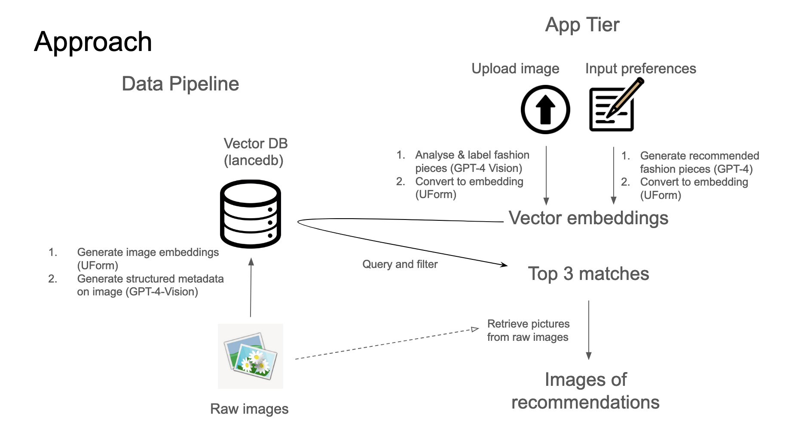

# StyleSync: Your Style Companion
[](https://stylesync.streamlit.app/)


Finding the perfect outfit for various occasions can be challenging. From browsing through multiple online stores to lacking a clear vision of the desired look, the process can be time-consuming and often frustrating. StyleSync aims to simplify this journey, offering personalized fashion recommendations tailored to individual preferences.


## Getting Started

To begin using StyleSync, follow these steps to set up your development environment:

> [!TIP]
> Use a virtual environment is recommended!

1. Install the required dependencies:
```
pip install -r requirements.txt
```

2. Launch the application with Streamlit:
```
streamlit run app.py
```

## Tech Stack

StyleSync employs a multi-modal search approach to fashion, combining the power of image and text analysis to deliver recommendations.

- **Uform-vl-english-small**: We utilize this model to generate image and text embedding. This is a lightweight model that can be deployed locally. [More details on uform here](https://github.com/unum-cloud/uform).

- **GPT-4 Vision**: For extracting structured metadata from images, we employ OpenAI's GPT-4 Vision model. This enhances our ability to interpret the visual aspects of fashion items accurately. [More details on GPT-4 Vision here](https://platform.openai.com/docs/guides/vision/vision).



## Ingesting Your Own Data

To enrich StyleSync with your own data, the following scripts are available:

- **Schema Extraction**:
Run `scripts/async_schema_extraction.py` to extract schema information from your data asynchronously.

- **Data Ingestion**:
Use `scripts/ingest_data.py` to ingest your fashion data into StyleSync.

By following these steps, you can contribute to the StyleSync database, allowing for a broader range of fashion recommendations.

## License

StyleSync is open-sourced under the MIT License. See the `LICENSE` file for more details.
